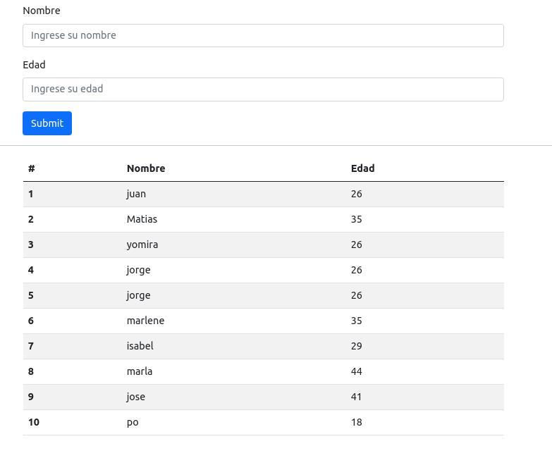

# PHP-MySQL-Docker-UdemyCourse

To be able to run this application it is necessary to have docker and docker-compose installed, you can find all the configuration in the corresponding files.

```
docker-compose up -d
```

## Ports used:

The default ports have been changed to be able to run several Apache servers at the same time and I have changed port 3306 to port 8082.
|Name|Port|  
|----|-----|  
|MySQL|8082|
|PHP|8000|

---

If you need to enter the container to play with MySQL like me the command you need is the following:

```
docker exec -it (container_id) /bin/bash
```

and for search the IP that you need in the code for MySQL connections:

```
docker container inspect (container_id)
```

## Screenshot:


